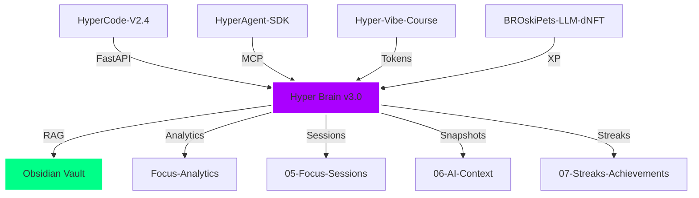

# 🌌 Brain Constellation Map

> Visual map of THE HYPER BRAIN ecosystem. Every node is alive.

---

## 🏗️ The 5-Repo Ecosystem + THE HYPER BRAIN



---

## 🧠 THE HYPER BRAIN Architecture

```
hyper-brain (port 8100)
├── hyper_brain_core.py      # FastAPI orchestrator
├── focus_tracker.py          # File watcher + session logger
├── ai_distraction_filter.py  # Context scoring
├── hyper_split.py            # Task decomposition
├── mcp_bridge.py             # Local LLM gateway
├── analytics_engine.py       # Reports + streaks
├── github_webhook_server.py  # Real-time sync
├── morning_briefing_ai.py    # AI briefing
└── session_snapshot.py       # State capture
```

---

## 🔗 Data Flow

1. **You focus** → `focus_tracker` watches vault edits
2. **Distraction hits** → `ai_distraction_filter` scores + suggests intervention
3. **Task too big** → `hyper_split` breaks it into micro-tasks
4. **Session ends** → `analytics_engine` awards BROski$ + XP + updates streaks
5. **Morning comes** → `morning_briefing_ai` generates prioritized briefing
6. **You crash** → `session_snapshot` captures state for instant recovery
7. **GitHub fires** → `github_webhook_server` writes to inbox in real-time
8. **You ask** → `mcp_bridge` queries local LLM with vault context

---

## 🎮 Level Progression

| Level | Feature | Status |
|-------|---------|--------|
| 9 | GitHub bridge | ✅ |
| 10 | Vault immortal | ✅ |
| 11 | BROski$ live | ✅ |
| 12 | Hyperfocus Mode | ✅ |
| 13 | Morning Briefing AI | ✅ |
| 14 | GitHub Webhooks | ✅ |
| 15 | HyperAgent AI Briefing | ✅ |
| 16 | Focus Tracker + Analytics | ✅ |
| 17 | HyperSplit | ✅ |
| 18 | AI Distraction Filter | ✅ |
| 19 | DifficultyDial + Dynamic Gamification | ✅ |
| 20 | THE HYPER BRAIN Constellation | ✅ |

---

> *"We are not just building tools. We are building a new kind of mind."*  
> **THE HYPER BRAIN v3.0 — Fully Operational. ♾️🧠⚡**
