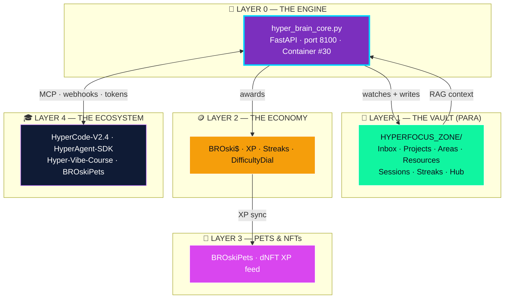

# 🌌 THE HYPER BRAIN — Constellation

> The living map of the whole z0ne. Every node links to where it actually lives.
> **Level 20 · Phase 1** — the navigable map. Phase 2 (`constellation_builder.py`) will auto-refresh the Live Status block.

> [!warning] Status honesty pass — 2026-05-22
> Two docs claimed **20/20 levels complete**, two said **17/20**. The May-5
> hand-off docs ([UPGRADE_COMPLETE_SUMMARY](../../UPGRADE_COMPLETE_SUMMARY.md)
> + the old Constellation) over-claimed at delivery. The newer, detailed docs —
> [WHATS_DONE](../../WHATS_DONE.md) (May 7) and
> [ANALYSIS_AND_ROADMAP](../../ANALYSIS_AND_ROADMAP.md) (May 10) — are the truth:
> **Levels 1–17 live · 18–19 partial · 20 in progress (this map).** This map
> now states the real status.

---

## 🗺️ The Constellation



---

## 🧠 Layer 0 — The Engine · `hyper-brain` (Container #30)

> [!info] [docker-compose.hyper-brain.yml](../../docker/docker-compose.hyper-brain.yml) · port **8100** · 256 MB cap
> Wake it: `docker compose -f docker/docker-compose.hyper-brain.yml up -d`
> Pulse:  `curl http://localhost:8100/health`

| Module | Role | Level |
|---|---|---|
| [hyper_brain_core.py](../../hyper_brain_core.py) | FastAPI orchestrator — 19 endpoints | 13 |
| [focus_tracker.py](../../focus_tracker.py) | Vault file-watcher + session logger | 16 |
| [analytics_engine.py](../../analytics_engine.py) | Heatmaps · weekly reports · streaks | 16 |
| [morning_briefing_ai.py](../../morning_briefing_ai.py) | AI-prioritised daily briefing | 13 |
| [github_webhook_server.py](../../github_webhook_server.py) | Real-time GitHub → vault | 14 |
| [mcp_bridge.py](../../mcp_bridge.py) | Local-LLM / MCP gateway | 15 |
| [hyper_split.py](../../hyper_split.py) | Recursive task decomposition | 17 |
| [session_snapshot.py](../../session_snapshot.py) | Crash-proof state capture + restore | 16 |
| [ai_distraction_filter.py](../../ai_distraction_filter.py) | Context scoring — drift detection | 18 🚧 |
| [gamification_summary.py](../../gamification_summary.py) | XP / streak roll-up | 19 🚧 |
| [events_feed.py](../../events_feed.py) | Live event stream for the dashboard | 16 |

**API surface (19 endpoints):** `/health` · `/ui` · `/ui/toolkit` · `/events` · `/gamification/summary` · `/focus/{start,end,status,snapshot}` · `/hypersplit` · `/distraction/{report,patterns}` · `/analytics/{weekly,streaks,heatmap}` · `/briefing/generate` · `/mcp/{status,query}` · `/webhook/github`

---

## 📂 Layer 1 — The Vault · PARA

| Folder | What lives there |
|---|---|
| [00-Inbox](../00-Inbox) | Brain dump · [GitHub captures](../00-Inbox/GitHub) · [Briefings](../00-Inbox/Briefings) |
| [01-Projects](../01-Projects) | Active builds · [HyperSplit-Tasks](../01-Projects/HyperSplit-Tasks) |
| [02-Areas](../02-Areas) | [Health](../02-Areas/Health) · [Admin](../02-Areas/Admin) · [DevOps](../02-Areas/DevOps) |
| [03-Resources](../03-Resources) | Snippets · economy · reference |
| [04-Archive](../04-Archive) | Done wins 🏆 |
| [05-Focus-Sessions](../05-Focus-Sessions) | Session logs with YAML metrics |
| [07-Streaks-Achievements](../07-Streaks-Achievements) | Streaks · recovery tokens |
| [99-Templates](../99-Templates) | Daily · Project · Focus-Session · HyperSplit |
| [Hub](.) | [Dashboard](Dashboard.md) · [Focus Command Center](Focus-Command-Center.md) · [Maps of Content](Maps-of-Content.md) · this map |

> [!note] The roadmap also planned `06-AI-Context/` (RAG chunks + embeddings) — not yet created. Tracked under Level 20 Phase 2.

---

## 🪙 Layer 2 — The Economy

- **BROski$** — earned per focus session, awarded on `/focus/end`
- **XP / Levels** — `gamification_summary.py` → `/gamification/summary`
- **Streaks** — `analytics_engine.py` → `/analytics/streaks`; recovery tokens in [07-Streaks-Achievements](../07-Streaks-Achievements)
- **DifficultyDial** — low / medium / hyper / chaos reward multipliers — **Level 19, partial** (spec in the [roadmap](../../ANALYSIS_AND_ROADMAP.md))

## 🐾 Layer 3 — Pets & NFTs

- **BROskiPets** — focus XP feeds the dNFT pet-evolution pipeline
- Bridge: brain XP → BROskiPets API → on-chain pet update *(Level 19 wiring)*

## 🎓 Layer 4 — The Ecosystem (5 repos)

| Repo | Link to the Brain |
|---|---|
| **HyperCode-V2.4** | FastAPI core · agents · the MCP gateway the bridge talks to |
| **HyperAgent-SDK** | Agent spec · `cluster.json` graduate-build target |
| **Hyper-Vibe-Course** | Token economy · the learner funnel |
| **BROskiPets-LLM-dNFT** | Pet XP sink for the focus economy |
| **BROski-Obsidian-Brain** | 🧠 *you are here* |

Agent cluster: [cluster.json](../../cluster.json) — 4 agents (`hyper-brain-core`, `mcp-bridge`, `focus-tracker`, `morning-briefing`).

---

## 🔁 The Loop

1. **You focus** → `focus_tracker` watches vault edits
2. **You drift** → `ai_distraction_filter` scores it → nudge / pause / re-split
3. **Task too big** → `hyper_split` shatters it into micro-tasks
4. **Session ends** → `analytics_engine` awards BROski$ + XP + updates streaks
5. **Morning** → `morning_briefing_ai` writes a prioritised briefing
6. **You crash** → `session_snapshot` restores your exact brain-state
7. **GitHub fires** → `github_webhook_server` drops it in the Inbox, instantly
8. **You ask** → `mcp_bridge` answers with full vault context

---

## 🎮 Level Progression — honest count

> **17 / 20 confirmed live · 18–19 partial · 20 in progress**

| Lvl | Feature | Status |
|---|---|---|
| 1–8 | Vault scaffold · PARA · plugins | ✅ Live |
| 9 | GitHub bridge | ✅ Live |
| 10 | Vault immortal (auto-commit) | ✅ Live |
| 11 | BROski$ coin tracker | ✅ Live |
| 12 | Hyperfocus CSS modes | ✅ Live |
| 13 | Morning Briefing AI | ✅ Live |
| 14 | GitHub webhooks real-time | ✅ Live |
| 15 | HyperAgent MCP bridge | ✅ Live |
| 16 | Focus tracker + analytics | ✅ Live |
| 17 | HyperSplit decomposition | ✅ Live |
| 18 | AI Distraction Filter | 🚧 Module + `/distraction/*` endpoints built — live session-wiring pending |
| 19 | DifficultyDial + Dynamic XP | 🚧 `/gamification/summary` built — multipliers + streak-recovery pending |
| 20 | THE HYPER BRAIN Constellation | 🛠️ **Phase 1 — this map — DONE** · Phase 2 (`constellation_builder.py` auto-update) pending |

Full specs for 18–20: [ANALYSIS_AND_ROADMAP.md](../../ANALYSIS_AND_ROADMAP.md).

---

## 📡 Live Status

> [!tip] Manual snapshot — 2026-05-22. **Level 20 Phase 2** (`constellation_builder.py`) will pull this live from `GET /health` + module statuses and auto-write it here.

```
System ........... 17/20 levels live (85%)
Container #30 .... defined — docker compose -f docker/docker-compose.hyper-brain.yml up -d
Engine API ....... :8100  — 19 endpoints
Vault ............ PARA intact · Obsidian Git auto-commit (10 min)
Next build ....... Level 18 wiring → Level 19 dial → Level 20 Phase 2
```

---

## 🧭 Quick Nav

[Dashboard](Dashboard.md) · [Focus Command Center](Focus-Command-Center.md) · [Maps of Content](Maps-of-Content.md) · [Roadmap](../../ANALYSIS_AND_ROADMAP.md) · [What's Done](../../WHATS_DONE.md)

---

> *"The brain that changes itself is the brain that builds itself."*
> **THE HYPER BRAIN v3.0 — Constellation · Level 20 Phase 1. ♾️🧠⚡**
